Building the framework and running a simulation under windows {#buildingUnderWindows}
==================

This guide considers that external dependencies have been installed into the system. 

CMake
------
Call cmake and  set the correct path to the source code (root directory) and choose a build directory.

It is strongly recommended to use a clean subdirectory e.g. build or buildWindows as the build process will create a lot of files and directories. 

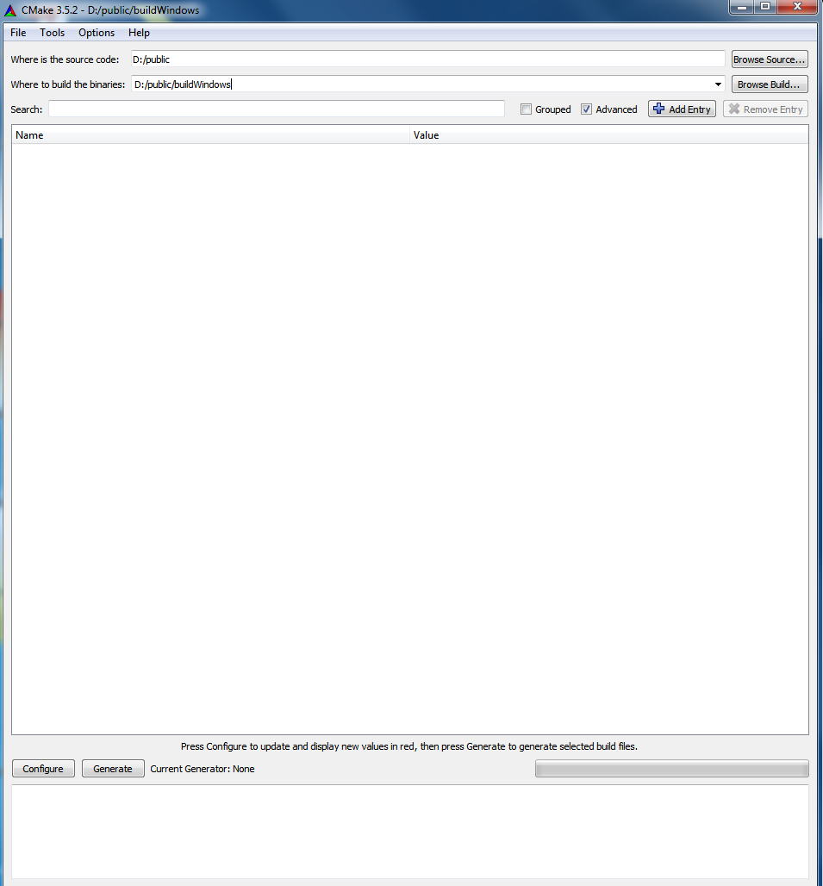


Configure
----------
Push configure and set the desired compiler. Be aware of the difference between a 32 Bit build an a 64 bit build.

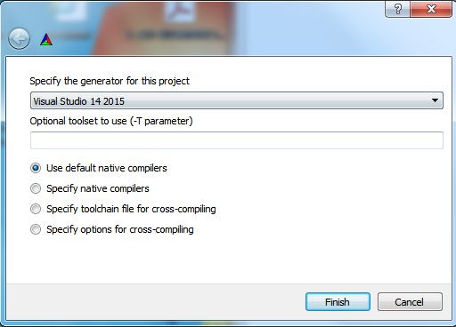

Select compiler
--------------

After selecting the compiler a few error messages might pop up, due to unresolved dependencies. This is normal and in the next step a dependency is resolved.

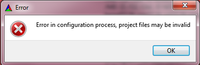

Unresolved dependencies
--------------
In this example the dependency for Matio is unresolved. 
The include directory and the library itself are not automatically found.

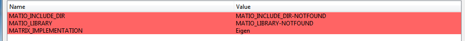

Choose the correct include directory for the source files and also choose the correct library. Pay special attention to the architecture (32 or 64 bits).

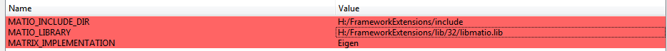


Useful build parameters
----------------------
After resolving the dependency, other useful parameters can be set. 
Take a look at the image below to see some useful paramters and their values.

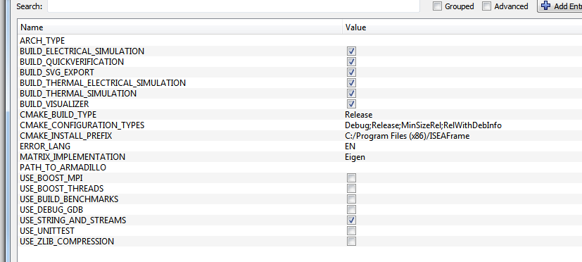

Finishing cmake configuration
----------------------------
Click 'Configure' and afterwards 'Generate'

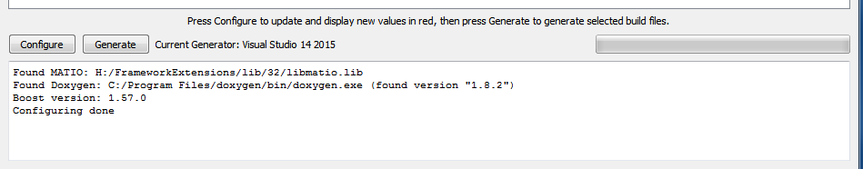
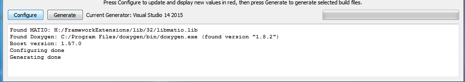


Building the framework in Visual Studio
------------------------------------------
After generation a Visual Studio Project is created in the destination folder.
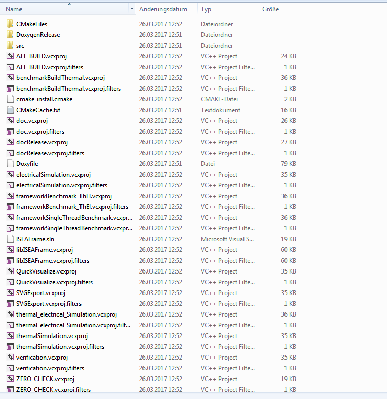

Open it in Visual Studio, set the options either to release or debug.
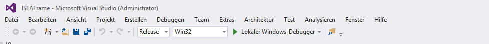

Create the project. It might take a while. 
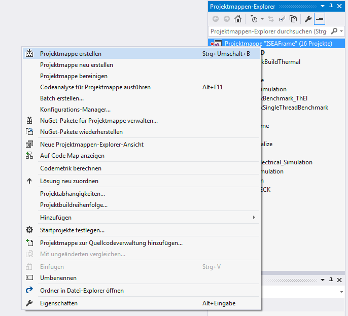

You should get a message that everything compiled correctly 
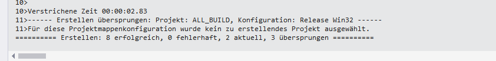

Copy missing libraries to the build directory
---------------------------------------------
In the build folder in the sub directory "Release" are the finished libraries and executables. 
For using the executables the missing .dll have to be copied into the folder as shown below.

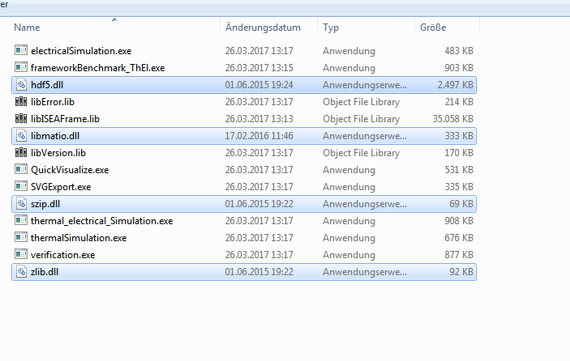

Simulating
------------
One can now start a simulation from the commandline by providing a simulation scenrario and a current profile.
The Framework comes with some example scenarios as well as two verfication profiles.

The simulation can be invoked by
```bash
./electricalSimulation.exe ../../scenarios/electrical/kokam_13Ah_el.xml ../../src/scenariotest/scenarioData/data_kokam_13Ah_pulse_electrical.mat
```
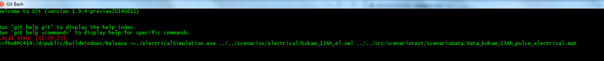

After The simulation has finished the simulation results can be found withibn a matlab struct
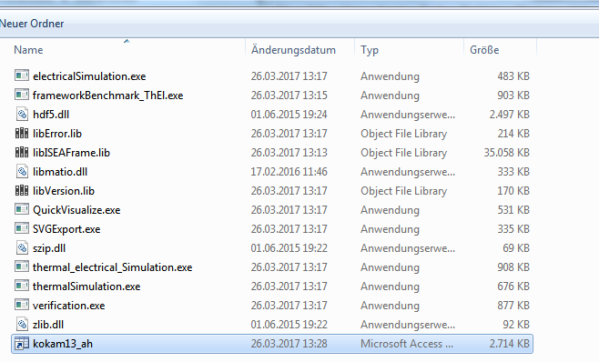

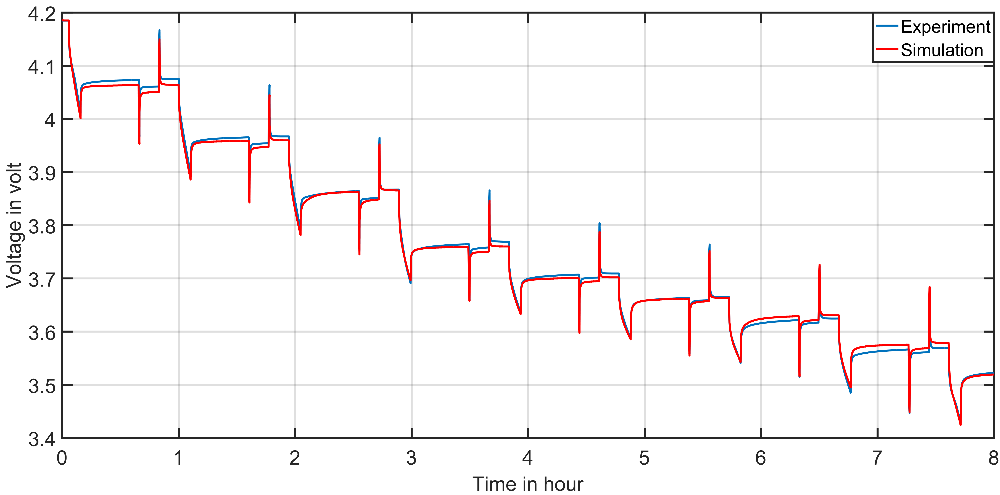


